# LR6

Лабораторная работа №6

## Цель лабораторной работы

изучение базовых возможностей системы управления версиями, опыт работы с Git Api, опыт работы с локальным и удаленным репозиторием.

## Команды терминала

* git config --global user.name
* git config --global user.email
* git clone
* git pull
* git checkout
* git log
* git merge
* git add
* git commit -m
* git push
* git branch -d
* git reset --hard HEAD~
* git branch
* git push origin
* git log --pretty=format:%h - %an, %ar : %s

## Ход работы

* Настраиваем профиль git

    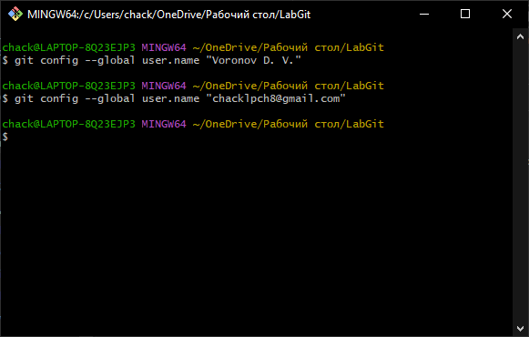
* Клонирование репозитория

    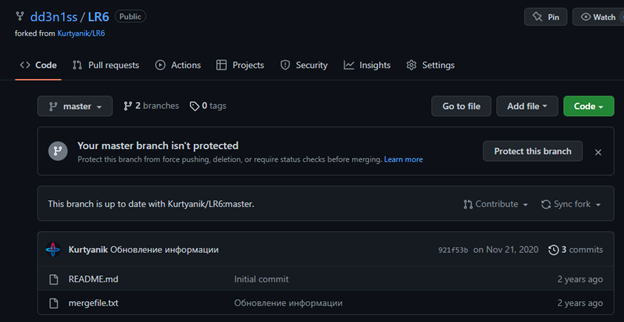
* Загрузка репозитория на локальную систему

    
* Создание файла

    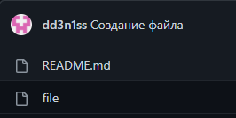
* Репозиторий до изменения

    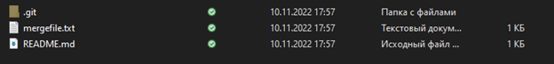
* Загрузка изменений из удаленного репозитория

    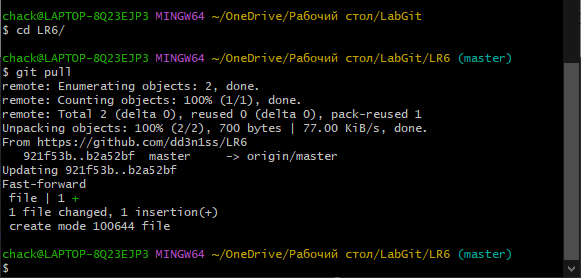
* Репозиторий после изменения

    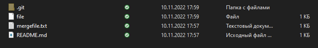
* История последних изменений ветки master

    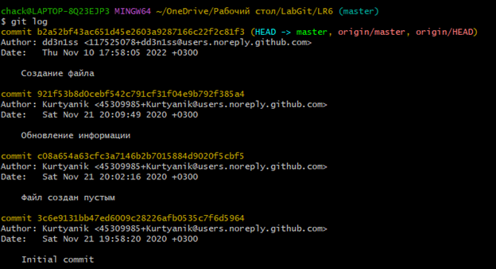

* Историй последних изменений ветки branch1

     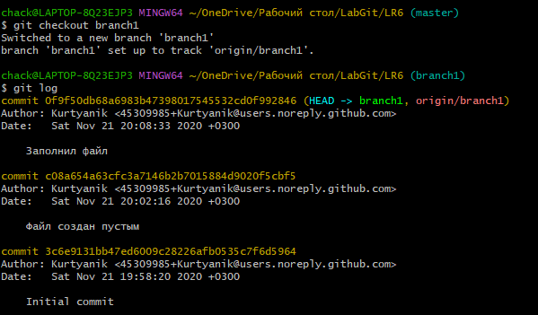
* Слияние веток с решением конфликта

     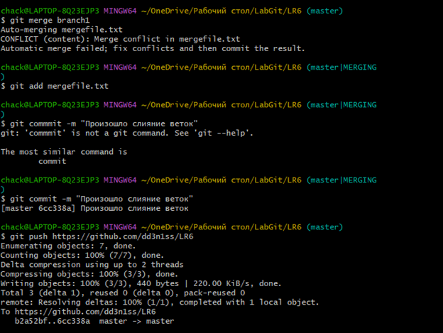
* Удаление ветки branch1
     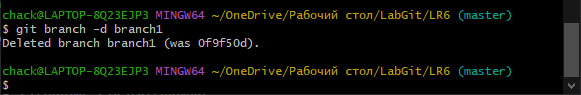
* Создание первого пустого файла

     
* Создание второго пустого файла

     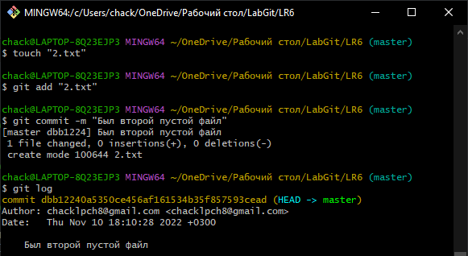
* Откат последнего коммита

     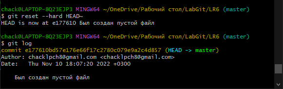
* Создание ветки otchet

     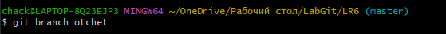
* Создание папки screenshot

     
* Вывод всех коммитов

     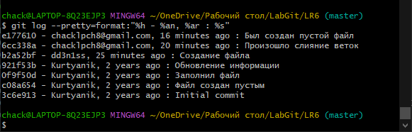

## Вывод

Мы изучили базовые возможности системы управления версиями, получили опыт работы с Git Api и опыт работы с локальным и удаленным репозиторием.